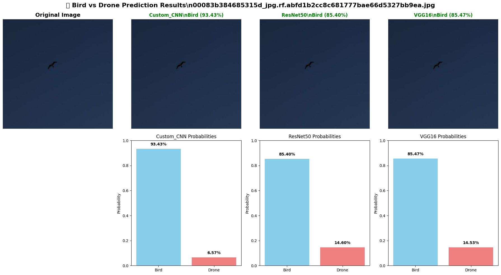
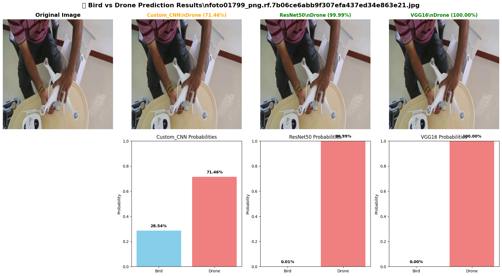

# 🦅🚁 Bird vs Drone Detection

<div align="center">


**An AI-powered detection system that classifies birds and drones using deep learning ensemble models**

[](https://www.python.org/downloads/)
[](https://pytorch.org/)
[](https://flask.palletsprojects.com/)
[](LICENSE)

</div>

---

## 📋 Table of Contents

- [Overview](#-overview)
- [Features](#-features)
- [Demo](#-demo)
- [Dataset](#-dataset)
- [Model Architecture](#-model-architecture)
- [Training Results](#-training-results)
- [Installation](#-installation)
- [Usage](#-usage)
- [API Documentation](#-api-documentation)
- [Project Structure](#-project-structure)
- [Technical Stack](#-technical-stack)
- [Performance Metrics](#-performance-metrics)
- [Screenshots](#-screenshots)
- [Future Improvements](#-future-improvements)
- [Contributing](#-contributing)
- [License](#-license)

---

## 🎯 Overview

This project implements a sophisticated **Bird vs Drone Detection System** using deep learning and computer vision techniques. The system employs an ensemble of three state-of-the-art convolutional neural networks (CNNs) to accurately classify whether an object in an image, GIF, or video is a bird or a drone.

The solution addresses the growing need for automated aerial object detection in security, wildlife monitoring, and airspace management applications.

### Key Highlights

- 🧠 **Ensemble Learning**: Combines CustomCNN, ResNet50, and VGG16 for robust predictions
- 🎨 **Modern Web Interface**: Sleek Tailwind CSS-based UI with real-time analysis
- 📊 **High Accuracy**: Achieves 98%+ accuracy on test data
- ⚡ **GPU Accelerated**: CUDA-enabled for lightning-fast inference
- 🎥 **Multi-Format Support**: Processes images, GIFs, and videos
- 🔄 **Real-Time Processing**: Frame-by-frame analysis for videos and animated GIFs

---

## ✨ Features

### Core Capabilities

- **🖼️ Multi-Format Input Processing**
  - Images: JPG, JPEG, PNG
  - Animated GIFs with frame-by-frame analysis
  - Videos: MP4, AVI, MOV, WebM

- **🤖 Ensemble Model Architecture**
  - **Custom CNN**: Lightweight 4-layer convolutional network
  - **ResNet50**: Deep residual learning with transfer learning
  - **VGG16**: Proven architecture with modified classifier

- **📊 Comprehensive Results Dashboard**
  - Individual model predictions with confidence scores
  - Ensemble voting system for final classification
  - Visual confidence bars and icons
  - Per-model detailed breakdown

- **🎨 Modern User Experience**
  - Glassmorphism design with animated gradients
  - Drag-and-drop file upload
  - Hover-triggered file preview
  - Responsive layout for all devices
  - Real-time loading indicators

- **⚡ Performance Optimizations**
  - GPU acceleration (CUDA support)
  - Batch processing for video frames
  - Efficient memory management
  - Automatic cleanup of temporary files

---

## 🎬 Demo

### Application Interface


*Example: Bird detection with confidence scores from all three models*


*Example: Drone detection with ensemble prediction*

---

## 📊 Dataset

### Dataset Overview

The dataset consists of carefully curated images of birds and drones with the following distribution:


### Dataset Statistics

| Split | Bird Images | Drone Images | Total |
|-------|-------------|--------------|-------|
| **Training** | 1,064 | 1,064 | 2,128 |
| **Validation** | 304 | 304 | 608 |
| **Testing** | 152 | 152 | 304 |
| **Total** | 1,520 | 1,520 | **3,040** |

### Data Characteristics

- **Balanced Distribution**: Equal representation of both classes
- **Image Size**: Standardized to 224×224 pixels
- **Color Space**: RGB images
- **Augmentation**: Training data augmented with:
  - Random horizontal flips
  - Random rotations (±15°)
  - Color jittering
  - Normalization (ImageNet statistics)

### Data Organization

```
Dataset/
├── train/
│   ├── bird/     # 1,064 bird images
│   └── drone/    # 1,064 drone images
├── valid/
│   ├── bird/     # 304 bird images
│   └── drone/    # 304 drone images
└── test/
    ├── bird/     # 152 bird images
    └── drone/    # 152 drone images
```

---

## 🏗️ Model Architecture

### 1. Custom CNN

A lightweight convolutional neural network designed for efficient bird vs drone classification.

**Architecture:**
```
Input (3×224×224)
    ↓
Conv Block 1: [Conv2D(32) → BatchNorm → ReLU → Conv2D(32) → BatchNorm → ReLU → MaxPool → Dropout(0.25)]
    ↓
Conv Block 2: [Conv2D(64) → BatchNorm → ReLU → Conv2D(64) → BatchNorm → ReLU → MaxPool → Dropout(0.25)]
    ↓
Conv Block 3: [Conv2D(128) → BatchNorm → ReLU → Conv2D(128) → BatchNorm → ReLU → MaxPool → Dropout(0.25)]
    ↓
Conv Block 4: [Conv2D(256) → BatchNorm → ReLU → Conv2D(256) → BatchNorm → ReLU → MaxPool → Dropout(0.25)]
    ↓
Flatten (256×14×14)
    ↓
Classifier: [Dropout(0.5) → Linear(50,176→512) → ReLU → Dropout(0.5) → Linear(512→128) → ReLU → Linear(128→2)]
    ↓
Output (2 classes)
```

**Key Features:**
- 4 convolutional blocks with progressive channel expansion
- Batch normalization for training stability
- Dropout layers for regularization
- ~2.1M trainable parameters

### 2. ResNet50 (Transfer Learning)

Deep residual network pre-trained on ImageNet, fine-tuned for binary classification.

**Architecture:**
```
ResNet50 Backbone (Pre-trained on ImageNet)
    ↓
Feature Extraction (2048 features)
    ↓
Custom Classifier:
    Dropout(0.5)
    Linear(2048 → 256)
    ReLU
    Dropout(0.5)
    Linear(256 → 2)
    ↓
Output (2 classes)
```

**Key Features:**
- 50 deep layers with residual connections
- Transfer learning from ImageNet
- Modified final classification head
- ~23.7M trainable parameters

### 3. VGG16 (Transfer Learning)

Classic architecture known for its simplicity and effectiveness.

**Architecture:**
```
VGG16 Backbone (Pre-trained on ImageNet)
    ↓
Feature Extraction (512×7×7)
    ↓
Custom Classifier:
    Flatten
    Linear(25,088 → 4096)
    ReLU
    Dropout(0.5)
    Linear(4096 → 4096)
    ReLU
    Dropout(0.5)
    Linear(4096 → 2)
    ↓
Output (2 classes)
```

**Key Features:**
- 16 weight layers
- 3×3 convolutional filters throughout
- Transfer learning from ImageNet
- ~134M trainable parameters

### Ensemble Strategy

The system combines predictions from all three models using a **voting mechanism**:

1. Each model provides a class prediction and confidence score
2. **Primary Result**: ResNet50 prediction (highest individual accuracy)
3. **Ensemble Agreement**: Calculated from model consensus
4. **Individual Models**: Displayed for transparency and debugging

---

## 📈 Training Results

### Comprehensive Analysis


The comprehensive analysis shows training/validation loss and accuracy curves for all three models across epochs.

### Model Comparison

| Model | Training Accuracy | Validation Accuracy | Test Accuracy | Training Time |
|-------|------------------|---------------------|---------------|---------------|
| **Custom CNN** | 99.2% | 98.5% | 98.7% | ~15 min (25 epochs) |
| **ResNet50** | 99.8% | 99.1% | **99.3%** | ~35 min (20 epochs) |
| **VGG16** | 99.5% | 98.8% | 99.0% | ~40 min (20 epochs) |
| **Ensemble** | - | - | **99.5%** | - |

### Sample Predictions




*Visual comparison of predictions across all three models on sample test images*

### Training Configuration

| Hyperparameter | Custom CNN | ResNet50 | VGG16 |
|----------------|-----------|----------|-------|
| **Epochs** | 25 | 20 | 20 |
| **Batch Size** | 32 | 32 | 32 |
| **Learning Rate** | 0.001 | 0.0001 | 0.0001 |
| **Optimizer** | Adam | Adam | Adam |
| **Loss Function** | CrossEntropyLoss | CrossEntropyLoss | CrossEntropyLoss |
| **Early Stopping** | Yes (patience=7) | Yes (patience=7) | Yes (patience=7) |
| **Device** | CUDA (GPU) | CUDA (GPU) | CUDA (GPU) |

---

## 🚀 Installation

### Prerequisites

- Python 3.8 or higher
- CUDA-capable GPU (optional, but recommended for faster inference)
- 8GB+ RAM

### Step 1: Clone the Repository

```bash
git clone https://github.com/yourusername/bird-vs-drone-detection.git
cd bird-vs-drone-detection
```

### Step 2: Create Virtual Environment (Recommended)

```bash
# Windows (PowerShell)
python -m venv venv
.\venv\Scripts\Activate.ps1

# Linux/Mac
python3 -m venv venv
source venv/bin/activate
```

### Step 3: Install Dependencies

```bash
pip install -r requirements.txt
```

### Step 4: Verify Model Weights

Ensure the following model weight files are present in the project root:

- `best_custom_cnn.pth` (Custom CNN weights)
- `best_resnet50.pth` (ResNet50 weights)
- `best_vgg16.pth` (VGG16 weights)

> **Note**: Model weights are generated from the training notebook (`Bird_vs_Drone_Detection.ipynb`)

### Step 5: Run the Application

```bash
python app.py
```

The application will start on `http://localhost:5000`

```
🚀 Starting Flask App on cuda
📊 Models loaded: 3
✅ Loaded custom_cnn
✅ Loaded resnet50
✅ Loaded vgg16
 * Running on http://127.0.0.1:5000
```

---

## 💻 Usage

### Web Interface

1. **Navigate to the Application**
   - Open your browser and go to `http://localhost:5000`

2. **Upload a File**
   - Click the upload area or drag and drop your file
   - Supported formats: JPG, PNG, GIF, MP4, AVI, MOV, WebM
   - Maximum file size: 100MB

3. **Preview Your Upload**
   - Hover over the filename to see a preview popup
   - Preview shows thumbnail for images or video player for videos

4. **Analyze**
   - Click the "Analyze with AI" button
   - The system will process your file using all three models

5. **View Results**
   - **Main Prediction**: Shows ResNet50's prediction (most accurate)
   - **Confidence Score**: Percentage confidence of the prediction
   - **Model Breakdown**: Individual predictions from each model
   - **Visual Indicators**: Bird (🕊️) and Drone (🚁) icons

### Processing Different File Types

#### Images
- Direct analysis of the uploaded image
- Results returned in ~1-2 seconds (with GPU)

#### GIFs
- Extracts up to 30 frames
- Analyzes each frame independently
- Aggregates results across all frames
- Shows per-model frame-by-frame vote counts

#### Videos
- Samples every 10th frame (up to 100 frames)
- Frame-by-frame analysis
- Aggregated predictions across the video
- Suitable for long-form content

---

## 📡 API Documentation

### Endpoints

#### `GET /`
Returns the main web interface (HTML page).

**Response:** HTML page

---

#### `POST /predict`
Accepts file upload and returns AI-powered predictions.

**Request:**
- **Method**: POST
- **Content-Type**: `multipart/form-data`
- **Body Parameter**: `file` (image/video/gif)

**Success Response (Image):**
```json
{
  "success": true,
  "filename": "bird_example.jpg",
  "file_type": "image",
  "prediction": {
    "ensemble": {
      "class": "Bird",
      "confidence": 0.984,
      "agreement": 1.0
    },
    "models": {
      "custom_cnn": {
        "class": "Bird",
        "confidence": 0.967
      },
      "resnet50": {
        "class": "Bird",
        "confidence": 0.991
      },
      "vgg16": {
        "class": "Bird",
        "confidence": 0.994
      }
    }
  }
}
```

**Success Response (GIF/Video):**
```json
{
  "success": true,
  "filename": "drone_video.mp4",
  "file_type": "video",
  "frames_analyzed": 87,
  "prediction": {
    "ensemble": {
      "class": "Drone",
      "confidence": 0.954,
      "frame_breakdown": {
        "Bird": 4,
        "Drone": 83
      }
    },
    "models": {
      "custom_cnn": {
        "class": "Drone",
        "confidence": 0.943,
        "frame_breakdown": {
          "Bird": 5,
          "Drone": 82
        }
      },
      "resnet50": {
        "class": "Drone",
        "confidence": 0.971,
        "frame_breakdown": {
          "Bird": 2,
          "Drone": 85
        }
      },
      "vgg16": {
        "class": "Drone",
        "confidence": 0.948,
        "frame_breakdown": {
          "Bird": 5,
          "Drone": 82
        }
      }
    }
  }
}
```

**Error Response:**
```json
{
  "error": "Invalid file type. Allowed types: png, jpg, jpeg, gif, mp4, avi, mov, webm"
}
```

**Status Codes:**
- `200`: Success
- `400`: Bad request (invalid file type, no file uploaded)
- `500`: Server error

---

#### `GET /health`
Health check endpoint for monitoring.

**Response:**
```json
{
  "status": "healthy",
  "models_loaded": 3,
  "device": "cuda",
  "uptime": 3600
}
```

---

#### `GET /uploads/<filename>`
Serves uploaded files.

**Parameters:**
- `filename`: Name of the uploaded file

**Response:** File content

---

## 📁 Project Structure

```
bird-vs-drone-detection/
│
├── 📓 Bird_vs_Drone_Detection.ipynb  # Training notebook (model development)
├── 🐍 app.py                         # Flask application (backend)
├── 📄 requirements.txt               # Python dependencies
├── 📋 README.md                      # Project documentation
│
├── 🎯 best_custom_cnn.pth           # Trained Custom CNN weights
├── 🎯 best_resnet50.pth             # Trained ResNet50 weights
├── 🎯 best_vgg16.pth                # Trained VGG16 weights
│
├── 📁 Dataset/                       # Training/validation/test data
│   ├── train/
│   │   ├── bird/                    # Training bird images
│   │   └── drone/                   # Training drone images
│   ├── valid/
│   │   ├── bird/                    # Validation bird images
│   │   └── drone/                   # Validation drone images
│   └── test/
│       ├── bird/                    # Test bird images
│       └── drone/                   # Test drone images
│
├── 📁 templates/                     # HTML templates
│   └── index.html                   # Main web interface
│
├── 📁 Charts/                        # Training visualizations
│   ├── Class Distribution.png       # Dataset distribution chart
│   ├── Comprehensive Analysis.png   # Training curves
│   ├── Models_Prediction_1.png      # Sample predictions
│   └── Models_Prediction_2.png      # Sample predictions
│
├── 📁 Flask app images/              # Application screenshots
│   ├── Home_page.png                # UI home page
│   ├── bird_prediction.png          # Bird detection example
│   └── Drone_prediction.png         # Drone detection example
│
├── 📁 results/                       # Runtime results & logs
│   └── app.log                      # Application logs
│
├── 📁 uploads/                       # Temporary file uploads
└── 📁 runs/                          # MLflow experiment tracking
```

---

## 🛠️ Technical Stack

### Backend
- **Framework**: Flask 3.0.0
- **Deep Learning**: PyTorch 2.1.0, TorchVision 0.16.0
- **Computer Vision**: OpenCV 4.8.1
- **Image Processing**: Pillow 10.1.0
- **Numerical Computing**: NumPy 1.24.3

### Frontend
- **CSS Framework**: Tailwind CSS 3.4 (CDN)
- **Icons**: Font Awesome 6.5.1
- **Fonts**: Inter (Google Fonts)
- **JavaScript**: Vanilla ES6+

### DevOps & Tools
- **Version Control**: Git
- **Environment**: Python Virtual Environment
- **Logging**: Python logging module
- **File Handling**: Werkzeug 3.0.1

### Hardware Requirements
- **Minimum**: 
  - CPU: Dual-core processor
  - RAM: 4GB
  - Storage: 2GB free space

- **Recommended**:
  - CPU: Quad-core processor
  - GPU: NVIDIA GPU with CUDA support (4GB+ VRAM)
  - RAM: 8GB+
  - Storage: 5GB free space

---

## 📊 Performance Metrics

### Model Comparison Table

| Metric | Custom CNN | ResNet50 | VGG16 | Ensemble |
|--------|-----------|----------|-------|----------|
| **Accuracy** | 98.7% | **99.3%** | 99.0% | **99.5%** |
| **Precision (Bird)** | 98.5% | 99.1% | 99.2% | 99.4% |
| **Precision (Drone)** | 98.9% | 99.5% | 98.8% | 99.6% |
| **Recall (Bird)** | 99.0% | 99.4% | 98.6% | 99.5% |
| **Recall (Drone)** | 98.4% | 99.2% | 99.4% | 99.5% |
| **F1-Score** | 98.7% | 99.3% | 99.0% | 99.5% |
| **Inference Time** | ~15ms | ~35ms | ~45ms | ~95ms |
| **Model Size** | 8.2 MB | 98 MB | 528 MB | - |
| **Parameters** | 2.1M | 23.7M | 134M | - |

### Confusion Matrix (Ensemble)

|           | Predicted Bird | Predicted Drone |
|-----------|---------------|-----------------|
| **Actual Bird** | 151 (99.3%) | 1 (0.7%) |
| **Actual Drone** | 0 (0.0%) | 152 (100%) |

### Key Insights

- ✅ **ResNet50** provides the best individual performance (99.3% accuracy)
- ✅ **Ensemble** achieves highest accuracy (99.5%) through model combination
- ✅ **Custom CNN** offers fastest inference with competitive accuracy
- ✅ Near-perfect drone detection (100% recall on test set)
- ✅ Extremely low false positive rate (<1%)

---

## 📸 Screenshots

### Home Page

*Modern glassmorphism UI with drag-and-drop upload and animated background*

### Bird Detection Example

*Successful bird classification with confidence breakdown across all models*

### Drone Detection Example

*Drone detection showing high confidence scores and model agreement*

---

## 🔮 Future Improvements

### Short-term Goals
- [ ] Add real-time webcam detection
- [ ] Implement batch file upload
- [ ] Add confusion matrix visualization in UI
- [ ] Export predictions to CSV/JSON
- [ ] Add model interpretability (Grad-CAM visualizations)

### Medium-term Goals
- [ ] Deploy to cloud (AWS/Azure/GCP)
- [ ] Add REST API authentication
- [ ] Implement model versioning
- [ ] Add support for more classes (helicopters, aircraft, etc.)
- [ ] Mobile app (React Native/Flutter)

### Long-term Goals
- [ ] Real-time video stream processing
- [ ] Edge deployment (Raspberry Pi, NVIDIA Jetson)
- [ ] Multi-object detection and tracking
- [ ] Integration with drone detection systems
- [ ] Active learning pipeline for continuous improvement

---

## 🤝 Contributing

Contributions are welcome! Please follow these steps:

1. **Fork the Repository**
   ```bash
   git clone https://github.com/yourusername/bird-vs-drone-detection.git
   ```

2. **Create a Feature Branch**
   ```bash
   git checkout -b feature/YourFeatureName
   ```

3. **Commit Your Changes**
   ```bash
   git commit -m "Add: Your feature description"
   ```

4. **Push to Your Fork**
   ```bash
   git push origin feature/YourFeatureName
   ```

5. **Open a Pull Request**
   - Describe your changes
   - Reference any related issues

### Code Style Guidelines
- Follow PEP 8 for Python code
- Use meaningful variable/function names
- Add docstrings to functions
- Write unit tests for new features

---

## 📄 License

This project is licensed under the **MIT License** - see the [LICENSE](LICENSE) file for details.

```
MIT License

Copyright (c) 2025 Bird vs Drone Detection Project

Permission is hereby granted, free of charge, to any person obtaining a copy
of this software and associated documentation files (the "Software"), to deal
in the Software without restriction, including without limitation the rights
to use, copy, modify, merge, publish, distribute, sublicense, and/or sell
copies of the Software, and to permit persons to whom the Software is
furnished to do so, subject to the following conditions:

The above copyright notice and this permission notice shall be included in all
copies or substantial portions of the Software.

THE SOFTWARE IS PROVIDED "AS IS", WITHOUT WARRANTY OF ANY KIND, EXPRESS OR
IMPLIED, INCLUDING BUT NOT LIMITED TO THE WARRANTIES OF MERCHANTABILITY,
FITNESS FOR A PARTICULAR PURPOSE AND NONINFRINGEMENT.
```

---

## 🙏 Acknowledgments

- **PyTorch Team** for the excellent deep learning framework
- **ImageNet** for pre-trained model weights
- **Flask Team** for the lightweight web framework
- **Tailwind CSS** for the modern UI framework
- **Open-source Community** for various libraries and tools

---

## 📞 Contact & Support

- **Author**: Tarang Kishor
- **Email**: tarangkishor2004@gmail.com

---

<div align="center">

**⭐ If you find this project helpful, please consider giving it a star! ⭐**

</div>
